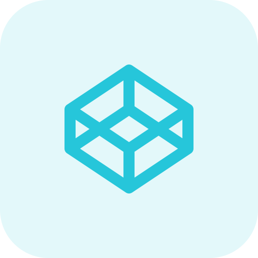

<!--

 

-->

 

<!-- GitHub Stats -->

<h2 align="center">
TECH STACK
</h2>

 
 
 

 
 
 

 
 
 
 
 
 
 
 

<h2 align="center">
CONNECT
</h2>

 
<!--
***RealityMoez/realitymoez*** is a ✨ _special_ ✨ repository because its `README.md` (this file) appears on your GitHub profile.

Here are some ideas to get you started:

- 🔭 I’m currently working on ...
- 🌱 I’m currently learning ...
- 👯 I’m looking to collaborate on ...
- 🤔 I’m looking for help with ...
- 💬 Ask me about ...
- 📫 How to reach me: ...
- 😄 Pronouns: ...
- ⚡ Fun fact: ...
-->
